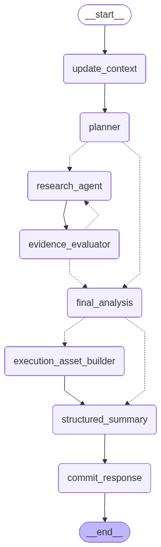

# Employment-Strategy-Agent

## ai서비스 설계 및 구현 충북대 부트캠프 최종 산출물

### 서비스 소개 및 사용 시나리오

취업 준비자가 보유한 자격증, 기술 역량, 프로젝트 경험, 어학 수준과 같은 개인 정보를 바탕으로 목표 기업 및 직무의 요구 역량을 분석하고, 사용자에게 맞춤형 취업 준비 전략을 제공하는 AI Agent 서비스이다.

시나리오 1 : 사용자 프로필 등록 및 기억
사용자의 현 취업 준비 상태를 입력 받아서 정보를 추출하고 사용자 프로필 상태를 저장하고 이후 대화에서 재사용한다.

시나리오 2 : 목표 기업 및 직무 분석
사용자에게 현재 관심 있는 기업 및 직무를 입력 받아 목표 기업, 직무를 구체적으로 설정하고 관련 내용을 웹에서 검색하거나 문서를 다운 받아 rag검색을 한다. 해당 내용을 기반으로 요구사항을 추출하고 사용자 역량과 비교하여 답변한다.

시나리오 3 : 최신 채용 일정 검색
사용자가 최신 채용 일정을 물어본다. Web 검색을 통해 최신 채용 관련 정보를 검색하고 결과를 정리하여 사용자에게 전달한다.

시나리오 4 : 사용자 개인 skill 분석
Memory에서 사용자 스펙을 조회하고 다운받은 기업의 채용 관련 pdf 검색 결과를 통해서 사용자 역량과 요구 역량을 비교하여 부족한 스펙을 사용자에게 전달한다.

시나리오 5 : 맞춤형 실행 계획 생성
사용자에게 앞으로의 채용 일정에 맞춰 계획 요구를 받는다. 사용자 개인 skill 분석 결과를 활용하여 우선순위 기반 일정을 생성하고 이를 사용자에게 전달한다.

시나리오 6 : 정보 부족 시 자동 재검색
사용자 개인 skill을 분석할 시 근거가 충분한지 평가하고 근거가 부족하다고 판정되면 검색어를 개선하고 추가 rag, web search를 수행하여 다시 분석한다. 근거가 충분해지면 최종 응답을 생성한다.

### 전체 아키텍처



### 설치 및 실행 방법

Python 3.11 환경에서 실행을 권장합니다.

```bash
pip install -r requirements.txt
```

위 명령어를 통해 필요한 패키지를 설치합니다.

`.env` 파일을 생성하여 다음 API Key를 설정합니다.

```env
OPENAI_API_KEY=your_openai_api_key
TAVILY_API_KEY=your_tavily_api_key
```

서버를 실행합니다.

```bash
python -m uvicorn server:app --reload
```

브라우저에서 아래 주소로 서비스를 확인합니다.

```text
http://127.0.0.1:8000
```

### 사용된 Tool / RAG / Memory / Middleware

#### Tool

1. `search_career_documents`

   사용자가 업로드한 채용 관련 PDF 문서를 검색하는 Tool이다.  
   Chroma Vector DB 기반 Retriever를 호출하여 사용자의 질의와 의미적으로 관련된 문서 Chunk를 검색한다.

2. `search_official_recruitment_web`

   기업 또는 공공기관의 채용 관련 정보를 검색하는 Tool이다.  
   Tavily Search를 사용하며 공식 도메인을 기준으로 검색한다.

3. `general_web_search`

   공식 채용자료와 PDF 문서만으로 정보가 부족한 경우 사용하는 보조 웹 검색 Tool이다.  
   Tavily Search를 사용하여 부족한 정보를 보완한다.

#### RAG

사용자가 업로드한 PDF 문서를 기반으로 답변할 수 있도록 RAG 파이프라인을 구성하였다.

##### 전체 흐름

```text
PDF 업로드
    ↓
PyPDFLoader
    ↓
RecursiveCharacterTextSplitter
    ↓
OpenAI Embeddings
    ↓
Chroma Vector DB
    ↓
Retriever
    ↓
관련 Chunk 검색
    ↓
Research Agent에 근거 제공
```

#### Memory

자연스러운 대화와 사용자 상태 유지를 위해 LangGraph의 State와 Checkpointer를 사용한다.

- `messages`: 사용자와 Agent의 대화 이력을 저장한다.
- `user_profile`: 사용자의 취업 관련 정보를 별도 상태로 누적한다.
- `InMemorySaver(checkpointer)`: LangGraph 상태를 저장하고 `thread_id`별로 대화 상태를 구분한다.

##### Memory 구조

```text
thread_id
    ↓
LangGraph Checkpointer
    ↓
CareerState
├── messages
├── user_profile
├── plan
├── research_result
├── evidence
├── retry_count
└── final_answer
```

#### Middleware

##### Middleware의 역할

1. Tool 실행 시작 기록
2. Tool 실행 성공 기록
3. Tool 오류 기록

### 한계점 및 향후 개선 방향

[한계점]

1. ai를 활용한 서비스를 구현하고자 했지만 llm을 이용해보기 위한 끼워맞추기식 개발이라 느꼈다. 적재적소에 알맞은 기능이 사용되었는지 제대로 판단할 수 없어서 아쉽다. 그리고 서비스 적인 요소가 적었다고 생각된다.

2. llm의 답변이 만족스럽지 못했다. 이를 개선하기 위해서 PromptTemplate를 막연하게 고치고 길게 작성했음에도 불구하고 답변이 오히려 딱딱하게 정해진 틀에만 맞춰지게 되었다. 기업마다 필요한 우대사항이나 요구 자격증이 다른데 이를 명확하게 짚어내지 못하고 반복해서 일반적으로 도움이 될만한 얘기만 해준다. 예를들어 "aws자격증을 따면 네트워크 관련 지식을 얻을 수 있으니 도움이 될 것이다"와 같은 근거없고 막연한 정보만을 전달해 준다.

3. middleware의 역할을 로깅으로 밖에 수행하지 못했다.

[개선 방향]

1. 관심 기업을 등록해두면 ai가 채용공고를 확인하고 이를 알림으로 전달해주는 기능이 들어간다면 좀 더 활용적인 서비스가 될 것이라 생각된다.

2. 프롬프트를 좀 더 구체적이고 명시적으로 보여줄 수 있도록 수정해야겠다. 단순히 막연한 정보를 가져오기 보다는 근거를 들어 계획을 세우고 명확한 목표를 전달해 주도록 수정해야 한다.
